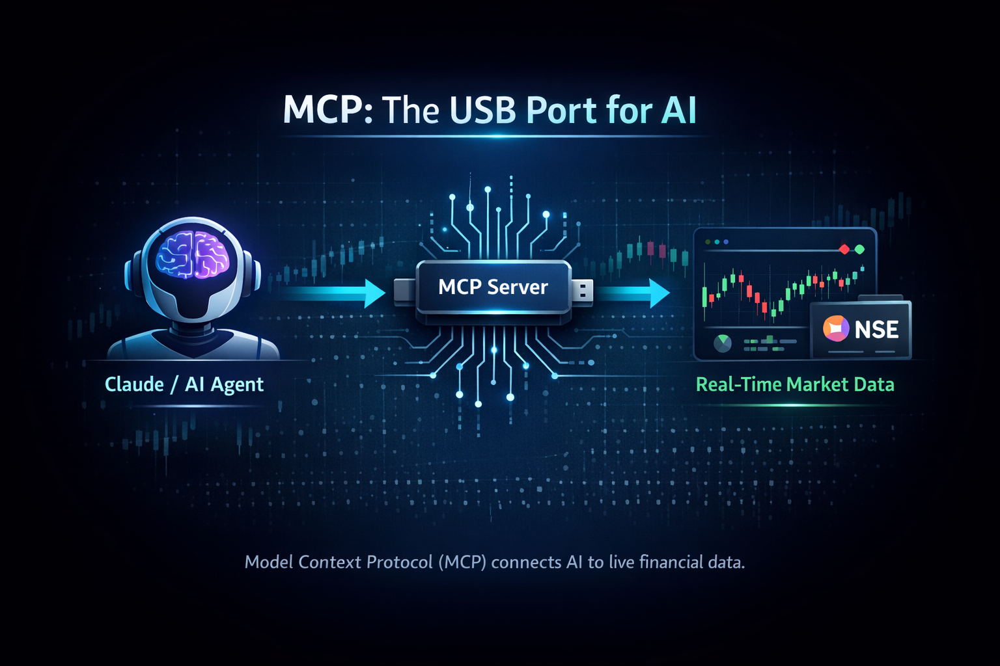

# The USB Port for AI: Connected Intelligence with the Upstox MCP Server

*Breaking the static data barrier: How the Model Context Protocol (MCP) connects AI agents like Claude to real-time market data for smarter financial analysis.*

---

You ask an AI, "Should I buy Nifty right now?"

It responds with a perfectly written explanation of RSI, MACD, and market psychology — and still has no idea that Nifty dropped 2% five minutes ago.

**This is the core problem with today's AI in finance:**  
**it can explain everything, but it can't see anything.**

And in the stock market, not seeing is the most expensive mistake you can make.

That changes today — with something called **Model Context Protocol (MCP)**.

---

## Why Traditional AI Analysis Falls Short

AI models are trained on historical data. Markets move every second.

Without live access, AI becomes:
- **A teacher, not an analyst**
- **A librarian, not a co-pilot**
- **Informative, but not actionable**

You end up acting as the middleman — copying prices, indicators, and screenshots into chat.

That's slow, error-prone, and completely unnecessary.

---

## What Is MCP? (Explain Like I'm 5)

*Model Context Protocol (MCP) connects AI agents like Claude to real-time market data — turning chatbots into decision-making copilots.*

**MCP is an open protocol that allows AI tools like Claude Desktop and Cursor to securely access external systems.**

Think of **MCP as the USB port for AI**.

Just like USB lets any computer connect to any device using a standard plug, MCP lets any AI agent connect to real-world systems — safely and consistently.

With MCP:
- AI doesn't guess
- AI calls tools
- AI uses real data
- AI reasons with context

**It turns AI from a chatbot into an agent.**

---

## Connecting Claude to Real Market Data

When an AI client like Claude connects to an MCP server, something powerful happens.

Instead of asking you for numbers, Claude simply:
- Fetches live prices
- Runs indicators
- Analyzes trends
- Considers portfolio context (read-only)

The AI knows when it needs data and which tool to call. 

This is **agentic AI** — autonomous, tool-driven, and grounded in real data.

---

## Upstox MCP Server: A Real Production Example

The **Upstox MCP Server** connects AI directly to the Indian stock market.

It exposes structured tools that allow AI to access:
- 📈 **Live LTP and OHLC data**
- 🕰️ **Historical candles** (1min → 1month)
- 📊 **Technical indicators** (RSI, MACD, EMA, ADX)
- 🕯️ **Candlestick pattern detection**
- 💼 **Read-only portfolio, positions, and margin**

This is not a demo — it's a **production-ready MCP server** used for live market analysis.

---

## How AI Analysis Changes With MCP

**Without MCP:**
> "Reliance is a large Indian conglomerate. Traders often use RSI and MACD…"

**With Upstox MCP:**
> "Reliance is trading at ₹2,530. RSI is 32 (near oversold), MACD is turning bullish, and a Bullish Engulfing pattern has formed on the 15-minute chart. Given your portfolio exposure, this adds diversification."

**Same AI. Completely different intelligence.**

---

## Why This Matters in the Modern AI Era

We're moving from:
- Chat-based AI → **Agent-based AI**
- Generic advice → **Contextual reasoning**
- Explanations → **Assisted decisions**

MCP enables:
1. **Secure data access**
2. **Real-time reasoning**
3. **Tool-driven intelligence**

In finance, that difference is everything.

---

## Why Developers Should Care

Building AI integrations today feels like plugin chaos.

**MCP simplifies everything:**
- Build **one MCP server**
- Support **all MCP-compatible AI clients**
- No vendor lock-in
- No rewrites

Think of MCP as **REST APIs for AI agents**.

If REST unlocked the web, **MCP unlocks intelligence**.

---

### Why the Upstox MCP Server Is a Blueprint

The **[Upstox MCP Server](https://github.com/ravikant1918/mcp-server-upstox)** demonstrates:
- Clean, layered architecture
- Namespaced, discoverable tools (23+ tools)
- Read-only safety by default
- OAuth-based authentication
- Production-grade performance

**It's not just a finance tool — it's a reference implementation for MCP itself.**

### What You Can Build Next

Any real-world system can become AI-accessible:
- **Trading & investing**
- **DevOps monitoring**
- **CRM analytics**
- **Healthcare records**
- **Internal enterprise tools**

If AI can call it, AI can reason with it.

**Getting Started:**
1. Fork the [Upstox MCP repo](https://github.com/ravikant1918/mcp-server-upstox)
2. Swap the Upstox API client for your own domain data source
3. Define your tools with FastMCP
4. Deploy and watch AI come alive

⭐ **Star the repo:** [github.com/ravikant1918/mcp-server-upstox](https://github.com/ravikant1918/mcp-server-upstox)

---

## Join the Movement

The Model Context Protocol is a **declaration that AI is ready for the real world**.

The days of the "blind" AI are over. The era of **connected, real-time intelligence** is here.

### 🚀 Take Action Now

**For Traders:**
- 📥 Install in 5 minutes: Clone [Upstox MCP](https://github.com/ravikant1918/mcp-server-upstox), configure your token
- 💬 Share your insights with #UpstoxMCP

**For Developers:**
- 🛠️ Fork and build for your domain
- 🌟 Contribute: PRs welcome
- 📚 Learn MCP by example

**For Everyone:**
- 🎤 Share this article
- 📖 Browse the [code](https://github.com/ravikant1918/mcp-server-upstox)

### 💡 What's Next?
- Multi-market integrations (NSE + NYSE + Crypto)
- AI-powered backtesting
- Pattern-triggered alerts
- Voice-driven trading

**The future of finance is conversational, intelligent, and connected.**

---

## 👉 Start Here

**Primary Action:** [github.com/ravikant1918/mcp-server-upstox](https://github.com/ravikant1918/mcp-server-upstox)

Explore the code. Star the repo. Build the future.

---

## 💬 Let's Talk

**Drop a comment:**
- What tool would you build with MCP?
- Traders: How would live AI change your workflow?
- Developers: What data would you connect?

**If this helped:**
- 👏 Clap 50 times
- 🔗 Share with your community  
- ⭐ Star the [repo](https://github.com/ravikant1918/mcp-server-upstox)

---

*#ModernAIDay #MCP #ClaudeAI #Upstox #FinTech #StockMarket #AIAgents #TradingTech #ConnectedIntelligence #UpstoxMCP #AgenticAI*
